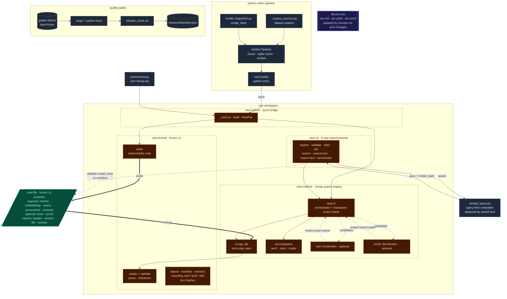

# nest

sovereign embedded vector database. single-file `.nest` container with content-addressable citations, reproducible builds, and offline-first model verification.

one file carries chunks, embeddings, source spans, optional ANN and BM25 indices, and a search contract. all hash-verified, memory-mapped, SIMD-friendly.

python builds. rust serves. nest ships. agents/llms read, that's it.

a portable binary format plus a runtime that opens it. the format is open and frozen at v1. the runtime is rust, mmaps the file, runs SIMD dot products straight off disk, and returns hits with stable citation IDs. there is no server. no API call. no central index. ship a curated knowledge base with the application instead of pointing at a hosted vector DB. some run on phones, some on edge nodes, some inside regulated environments where queries must not leave the box.

the file is the database.

## information optimization target
(∂μfμν = jν)

## sovereign data is our priority

four properties, all enforced by the format itself, not by policy.

**self-contained.** a `.nest` file is the entire knowledge base. chunks, embeddings, source spans, search contract, indices. you copy it like you copy a SQLite db. no schema migrations, no companion files, no external service to look up.

**cryptographically verifiable.** every section has its own SHA-256 over the physical bytes. the file has a SHA-256 footer. the canonical content has a third hash, computed over the decoded bytes, that survives compression and lets two builds of the same logical content prove they are the same content. every hit comes back with a `nest://content_hash/chunk_id` citation that reopens the exact byte span it came from.

**reproducible.** same chunks plus same model fingerprint plus `reproducible=True` produce byte-identical files. two operators on two machines build the same `file_hash`. this is what makes the citation URI useful: it points at content, not at a copy.

**offline-first by construction.** the runtime never opens a socket. queries are answered from mmap. the embedding model the corpus was built with is identified by a granular fingerprint (config plus tokenizer plus weights plus pooling plus dim plus normalize), and `nest search-text --model-path /path/to/local/snapshot` lets you operate without ever touching huggingface. mismatches between the runtime model and the corpus model fail loudly, not silently.

put together: nobody outside the operator's machine has to be online, trusted, or even reachable for the database to work. that is what "sovereign" means here.

## architecture

python builds, rust serves. the .nest file is the contract between them. one writer pipeline produces a deterministic container; one mmap-backed runtime opens it and answers queries through a SIMD-dispatched search path. the cli and the python api are thin surfaces over the same runtime.



the diagram reads top to bottom in five layers: python writer pipeline, the `.nest` contract, the rust workspace (four crates), the query-time helpers and user-facing api, and the quality gates. the `.nest` file is the single artifact that crosses the language boundary. search.rs is the conductor on the rust side: it owns mandatory exact-cosine rerank for both hnsw and bm25 candidate paths. the doc/arc trio is updated by humans and agents on architecture-touching changes, not by ci.

four crates plus a python tooling layer:

- `nest-format` owns the frozen v1 container: layout, manifest, sections, encodings, hashes.
- `nest-runtime` owns the mmap, the simd dispatcher, hnsw, bm25, and the search path with mandatory exact rerank.
- `nest-cli` is a thin clap surface with eight subcommands.
- `nest-python` is the pyo3 bridge that exposes the runtime to python.
- `python/` holds the writer pipeline, model fingerprint, and the query-time embedder used by `search-text`.

full visual map: [doc/arc/arc.mmd](doc/arc/arc.mmd). human reference: [doc/arc/arc.md](doc/arc/arc.md). machine map: [doc/arc/arc.yaml](doc/arc/arc.yaml).

## install

requires rust edition 2024 and python 3.12+.

```
cargo build --release --workspace
cp target/release/lib_nest.dylib python/_nest.so   # macOS
cp target/release/lib_nest.so   python/_nest.so    # linux
```

## CLI

```
nest inspect     <file>                       header, manifest, hashes (--json available)
nest validate    <file>                       full integrity check
nest stats       <file>                       sizes, counts, dtype, model, simd backend
nest search      <file> <qvec> -k K           exact top-k, query is a JSON array of f32
nest search-ann  <file> <qvec> -k K --ef N    HNSW path with exact rerank
nest search-text <file> "query" -k K [--model-path PATH] [--skip-model-hash-check]
nest benchmark   <file> -q N -k K [--ann EF] [--madvise-cold]
nest cite        <file> nest://<content_hash>/<chunk_id>
```

`search` takes a vector. `search-text` shells out to a python embedder, validates the model fingerprint against the manifest, then routes to the declared `index_type` (exact, hnsw, hybrid). a model mismatch fails with a typed error, never silently.

## python

```
import sys; sys.path.insert(0, "python"); import nest

db = nest.open(path)

hits = db.search(qvec, k=5)
hits[0].citation_id     # nest://content_hash/chunk_id
hits[0].source_uri
hits[0].offset_start, hits[0].offset_end
hits[0].score           # real cosine, not an ANN proxy

# with HNSW present:
hits = db.search_ann(qvec, k=5, ef=100)

# hybrid (BM25 union vector, then exact rerank):
hits = db.search_hybrid(qvec, query_text, k=5, candidates=200)

db.validate()
db.inspect()
```

build a file:

```
nest.build(
    output_path,
    embedding_model,
    embedding_dim,
    chunker_version,
    model_hash,            # sha256(canonical_json(fingerprint)), see python/model_fingerprint.py
    chunks,                # [{canonical_text, source_uri, byte_start, byte_end, embedding}]
    reproducible=True,
    preset="exact",        # "compressed" | "tiny" | "hybrid"
)
```

or via `Pipeline` in `python/builder.py` with chunker, SQLite cache, and auto-validate.

## presets

| preset       | text encoding | embeddings | ANN | BM25 | size ratio | recall@10 |
|--------------|---------------|------------|-----|------|-----------:|----------:|
| `exact`      | raw           | float32    | no  | no   |     1.000  |   1.0000  |
| `compressed` | zstd          | float16    | no  | no   |     0.350  |   1.0000  |
| `tiny`       | zstd          | int8       | yes | no   |     0.283  |   0.9920  |
| `hybrid`     | zstd          | float32    | yes | yes  |     0.668  |   1.0000  |

numbers measured on a 30,725-chunk PT-BR corpus, dim=384, NEON. `tiny` is the smallest distributable form, `hybrid` recovers lexical recall on rare terms, `exact` is the recall-1.0 ground truth.

## v0.2 highlights

flat exact search remains the recall-1.0 baseline.

added on top, all inside v1 (no format break):

- wire encodings 1, 2, 3: zstd for text sections, float16 and int8 for embeddings. `content_hash` is over decoded bytes, so citations are stable across encodings.
- HNSW (section 0x07) and BM25 (section 0x08) as optional sections, with mandatory exact rerank so the `score` field is real cosine, not an ANN proxy.
- SIMD dispatcher: AVX2 on x86_64, NEON on aarch64, scalar fallback. `NEST_FORCE_SCALAR=1` for A/B benchmarks. accumulators are always f32 regardless of dtype.
- `nest search-text` with reproducible model fingerprint and `--model-path` for fully offline operation. supersedes the v1 "vector only" CLI restriction.
- `madvise-cold` benchmark for first-hit-after-boot latency bound.
- four presets that bundle the above into named tradeoffs.

builds with `reproducible=True` are byte-identical for the same input.

## tests and release verification

```
cargo test --release --workspace
python tests/test_e2e.py
python tests/test_builder.py
python tests/test_search_text_model_hash.py
./scripts/release_check.sh
```

`release_check.sh` runs the full pipeline: build, test, clippy, fmt, line-count guard, python tests, ruff, `measure_presets.py`, `compare_measure.py` against the committed baseline. exits non-zero on any failure.

## the demo corpus that ships with nest

`dat/corpus_next.v1.nest` is built from seven public PT-BR fake-news datasets unified by truw: `FakeBr-hf`, `FakeTrue.Br-hf`, `Fake.br-Corpus`, `FakeRecogna`, `FakeTrue.Br`, `factck-br`, and `portuguese-fake-news-classifier-bilstm-combined`. raw datasets and the embedding cache live under `dat/demo/` as local-only, gitignored assets. rebuild from source with:

```
python python/tools/nest_build_corpus.py
```

with `reproducible=True` (the script default) two operators get byte-identical `file_hash`. see `dat/demo/README.md` for download commands, what each subdirectory contains, the schema of the v2 truw canonical CSV, and per-dataset license notes.

## reference

- `dat/demo/README.md` for what each upstream dataset is and how to rebuild the corpus
- `doc/arc/arc.md` for architecture, binary layout, API surface, errors, and versioning
- `doc/arc/arc.yaml` for the machine-readable architecture map used by agents and tooling
- `doc/arc/arc.mmd` for the mermaid visual map of gateway, build, format, runtime, data, and monitoring
- `doc/usage.md` for the eight commands, presets, offline mode, citations
- `doc/changelog.md` for v0.1 to v0.2 deltas

## license

made it simple, but signifcant. 
Brenner Cruvinel.

MIT.
