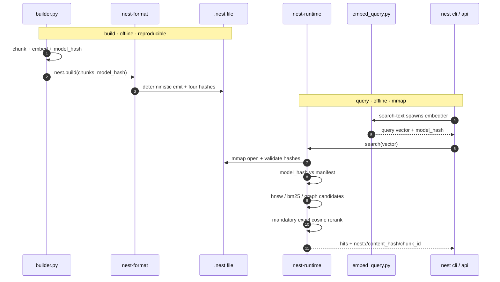

# nest

sovereign embedded vector database. single-file `.nest` container with content-addressable citations, reproducible builds, and offline-first model verification.

one file carries chunks, embeddings, source spans, optional ANN and BM25 indices, and a search contract. all hash-verified, memory-mapped, SIMD-friendly.

python builds. rust serves. nest ships. agents/llms read, that's it.

a portable binary format plus a runtime that opens it. the format is open and frozen at v1. the runtime is rust, mmaps the file, runs SIMD dot products straight off disk, and returns hits with stable citation IDs. there is no server. no API call. no central index. ship a curated knowledge base with the application instead of pointing at a hosted vector DB. some run on phones, some on edge nodes, some inside regulated environments where queries must not leave the box.

the file is the database.

## sovereign data is our priority

four properties, all enforced by the format itself, not by policy.

**self-contained.** a `.nest` file is the entire knowledge base. chunks, embeddings, source spans, search contract, indices. you copy it like you copy a SQLite db. no schema migrations, no companion files, no external service to look up.

**cryptographically verifiable.** every section has its own SHA-256 over the physical bytes. the file has a SHA-256 footer. the canonical content has a third hash, computed over the decoded bytes, that survives compression and lets two builds of the same logical content prove they are the same content. every hit comes back with a `nest://content_hash/chunk_id` citation that resolves (via `nest cite`) to the stored canonical text of that chunk plus its recorded source offsets and verifying hashes — tier-1, not a reopen of the original source document (which the self-contained file does not carry).

**reproducible.** same chunks plus same model fingerprint plus `reproducible=True` produce byte-identical files. two operators on two machines build the same `file_hash`. this is what makes the citation URI useful: it points at content, not at a copy.

**offline-first by construction.** the runtime never opens a socket. queries are answered from mmap. the embedding model the corpus was built with is identified by a granular fingerprint (config plus tokenizer plus weights plus pooling plus dim plus normalize), and `nest search-text --model-path /path/to/local/snapshot` lets you operate without ever touching huggingface. mismatches between the runtime model and the corpus model fail loudly, not silently.

put together: nobody outside the operator's machine has to be online, trusted, or even reachable for the database to work. that is what "sovereign" means here.

## architecture

python builds, rust serves. the .nest file is the contract between them. one writer pipeline produces a deterministic container; one mmap-backed runtime opens it and answers queries through a SIMD-dispatched search path. the cli and the python api are thin surfaces over the same runtime.



the sequence traces the two flows that define nest. build (python, offline, reproducible) chunks, embeds, fingerprints the model, and writes a deterministic `.nest` file with four hashes. query (rust, offline, mmap) opens the file, validates the embedder's `model_hash` against the manifest, gathers hnsw, bm25, or graph candidates, and reranks them with exact cosine before returning citations. the `.nest` file is the only artifact that crosses between python and rust.

four crates plus a python tooling layer:

- `nest-format` owns the frozen v1 container: layout, manifest, sections, encodings, hashes.
- `nest-runtime` owns the mmap, the simd dispatcher, hnsw, bm25, and the search path with mandatory exact rerank.
- `nest-cli` is a thin clap surface with the nine engine subcommands plus the agent-native flagship verbs `ask` and `retrieve` layered over the same engine.
- `nest-python` is the pyo3 bridge that exposes the runtime to python (incl the agent-native `NestFile.retrieve`).
- `python/` holds the writer pipeline, model fingerprint, the query-time embedder used by `search-text`, and the offline potion embedder + retrieve convenience the flagship verbs use.

full visual map: [doc/arc/arc.mmd](doc/arc/arc.mmd). human and machine reference: [doc/arc/arc.yaml](doc/arc/arc.yaml).

## install

requires rust edition 2024 and python 3.12+.

```
cargo build --release --workspace
cp target/release/lib_nest.dylib python/_nest.so   # macOS
cp target/release/lib_nest.so   python/_nest.so    # linux
```

## CLI

```
nest ask         <file> "query" -k K [--disclose answer|explain]   flagship: cited answer
nest retrieve    <file> "query" -k K [--format jsonl|json]          flagship: cited answer-pack
nest inspect     <file>                       header, manifest, hashes (--json available)
nest validate    <file>                       full integrity check
nest stats       <file>                       sizes, counts, dtype, model, simd backend
nest search      <file> <qvec> -k K           exact top-k, query is a JSON array of f32
nest search-ann  <file> <qvec> -k K --ef N    HNSW path with exact rerank
nest search-graph <file> <qvec> -k K --hops N --ef N   chunk-graph bfs with exact rerank
nest search-text <file> "query" -k K [--model-path PATH] [--skip-model-hash-check]
nest benchmark   <file> -q N -k K [--ann EF] [--madvise-cold]
nest cite        <file> nest://<content_hash>/<chunk_id>
```

`ask` and `retrieve` are the agent-native flagship: text query in, cited answer out. they embed the query OFFLINE with the default potion static table (never sentence-transformers, so they work offline-by-construction), validate the embedder's `model_hash` against the manifest, and route by manifest capability. `ask --disclose answer` (default) prints the cited canonical text and a `nest://` citation; `--disclose explain` adds the rerank-source honesty line ("real cosine" vs "real cosine at stored precision"). `retrieve` emits a json/jsonl answer-pack where every hit's score IS the exact-cosine rerank value, with the tier-1 stored canonical text + verifying hashes + the citation. `cite` is tier-1: it returns the stored canonical text + verifying hashes, never an original-byte reopen.

`search` takes a vector. `search-text` shells out to a python embedder, validates the model fingerprint against the manifest, then routes to the declared `index_type` (exact, hnsw, hybrid). a model mismatch fails with a typed error, never silently.

## python

```
import sys; sys.path.insert(0, "python"); import nest

db = nest.open(path)

hits = db.search(qvec, k=5)
hits[0].citation_id     # nest://content_hash/chunk_id
hits[0].source_uri
hits[0].offset_start, hits[0].offset_end
hits[0].score           # real cosine, not an ANN proxy

# with HNSW present:
hits = db.search_ann(qvec, k=5, ef=100)

# hybrid (BM25 union vector, then exact rerank):
hits = db.search_hybrid(qvec, query_text, k=5, candidates=200)

# agent-native: routes by manifest capability, score IS the exact rerank value,
# each hit carries the tier-1 stored canonical text + the nest:// citation.
hits = db.retrieve(qvec, k=5)
hits[0].text            # tier-1 stored canonical text (same bytes cite returns)
hits[0].rerank_source   # "full_precision" | "stored_precision"

db.validate()
db.inspect()
```

for the offline one-gif demo (potion embed -> retrieve -> cited answer over the cc0 demo corpus): `python python/forge/retrieve.py`.

build a file:

```
nest.build(
    output_path,
    embedding_model,
    embedding_dim,
    chunker_version,
    model_hash,            # sha256(canonical_json(fingerprint)), see python/model_fingerprint.py
    chunks,                # [{canonical_text, source_uri, byte_start, byte_end, embedding}]
    reproducible=True,
    preset="exact",        # "compressed" | "tiny" | "nano" | "hybrid" (+ "micro" via measure ladder)
    # mrl_dim=256,         # optional matryoshka prefix dim (truncate + renorm)
)
```

or via `Pipeline` in `python/builder.py` with chunker, SQLite cache, and auto-validate.

## presets

| preset       | text encoding | embeddings  | ANN | BM25 | size ratio | recall@10 |
|--------------|---------------|-------------|-----|------|-----------:|----------:|
| `exact`      | raw           | float32     | no  | no   |     1.000  |   1.0000  |
| `compressed` | zstd          | float16     | no  | no   |     0.339  |   1.0000  |
| `tiny`       | zstd          | int8        | yes | no   |     0.256  |   0.9920  |
| `micro`      | zstd          | mrl256-int8 | yes | no   |     0.223  |   0.8100  |
| `nano`       | zstd          | int4        | yes | no   |     0.209  |   0.9130  |
| `hybrid`     | zstd          | float32     | yes | yes  |     0.609  |   1.0000  |

numbers measured on a 30,725-chunk PT-BR corpus, dim=384, NEON, k=10 vs the float32 exact baseline, 100 queries (the published ladder, `dat/measure/ladder.json`; gated against `dat/measure/baseline.json`). RULER CAVEAT: these `recall@10` figures use a SELF-PERTURBATION ruler (each query is a corpus vector plus tiny noise, a near-duplicate of an existing point), so they report rank-stability under quantization, NOT real-query retrieval quality, and are likely inflated; the `ruler` field in `ladder.json`/`baseline.json` records this, and the real-query (mteb-style) ruler is pending (gate-zero). these are the honest current sizes: the text-codec repack (intpack chunk_ids/spans, bitpacked hnsw/bm25) shrank the indexed presets below the v0.2 published figures (`tiny` 0.283 -> 0.256, `compressed` 0.350 -> 0.339, `hybrid` 0.668 -> 0.609). `nano` is the smallest distributable form: int4 block-64 stored-precision embeddings (the embeddings section drops from int8's 11.92 MB to 6.27 MB, ~1.9x smaller, ~7.5x over float32). `micro` is the matryoshka size lever (the documented honest point `mrl256-int8`: 256-of-384 prefix at int8). every sub-int8 preset (`micro`/`nano` and the whole mrl curve) is STORED-PRECISION: the 0x09 `embeddings_fp` rerank source is not wired, so the net-of-fp ratio equals the stored ratio and `recall@10`/`score` are real cosine AT THE STORED PRECISION (int4/int8), disclosed via `dtype` (and `mrl_dim`/`full_dim` for `micro`) in `nest stats` and on every result, never a bare-slab claim. `nano`/`micro` need `embedding_dim` divisible by 64. `hybrid` recovers lexical recall on rare terms, `exact` is the recall-1.0 ground truth.

### matryoshka prefix truncation (`mrl_dim`)

`nest.build(mrl_dim=K)` is a build-time dimension lever orthogonal to and multiplicative with the dtype levers (Qwen3/ST/BGE truncate-then-renormalize). each l2-normalized vector is sliced to its first `K` components and re-l2-normalized on the prefix BEFORE quantization, so int8/int4 calibrate on the shorter renormalized row and the stored `embedding_dim` becomes `K` (the source dim is recorded as `full_dim`, both shown in `nest stats`). exact rerank stays real cosine because the prefix is renormalized; the truncation is a pure deterministic slice so builds stay byte-identical. `content_hash` is over the truncated embeddings, so a citation is tied to its `mrl_dim` (not stable across dims).

the lever earns its keep on a matryoshka-trained model (where information front-loads). the shipped MiniLM baseline is NOT mrl-trained, so on it truncation costs real recall@10, reported honestly as a curve (100 queries, k=10; same self-perturbation ruler as above, see the RULER CAVEAT):

| ladder        | size ratio | recall@10 |
|---------------|-----------:|----------:|
| `mrl256-int8` |     0.223  |   0.810   |
| `mrl192-int8` |     0.207  |   0.733   |
| `mrl128-int8` |     0.190  |   0.659   |
| `mrl96-int8`  |     0.182  |   0.574   |
| `mrl256-int4` |     0.191  |   0.777   |
| `mrl192-int4` |     0.183  |   0.713   |
| `mrl128-int4` |     0.174  |   0.627   |

int4 needs the effective dim divisible by 64, so the int4 ladder is valid only at `mrl_dim` in {256, 192, 128} (96 is blocked). on this non-mrl baseline no ladder point holds `nano`'s 0.913 recall, so `nano` (full-dim int4) still wins on recall while every mrl point is smaller; `mrl256-int8` (0.223 ratio, 0.810 recall) is the smallest point within tolerance, published as the named `micro` preset, the lever to reach for when size beats the last ~10 recall points or once a real mrl-trained model lands. the full curve is published in `dat/measure/ladder.json` (100 queries, k=10); `python/tools/measure_presets.py` emits it and `python/tools/compare_measure.py` gates `micro`/`nano` against `dat/measure/baseline.json`.

## v0.2 highlights

flat exact search remains the recall-1.0 baseline.

added on top, all inside v1 (no format break):

- wire encodings 1, 2, 3: zstd for text sections, float16 and int8 for embeddings. `content_hash` is over decoded bytes, so citations are stable across encodings.
- HNSW (section 0x07) and BM25 (section 0x08) as optional sections, with mandatory exact rerank so the `score` field is real cosine, not an ANN proxy.
- SIMD dispatcher: AVX2 on x86_64, NEON on aarch64, scalar fallback. `NEST_FORCE_SCALAR=1` for A/B benchmarks. accumulators are always f32 regardless of dtype.
- `nest search-text` with reproducible model fingerprint and `--model-path` for fully offline operation. supersedes the v1 "vector only" CLI restriction.
- `madvise-cold` benchmark for first-hit-after-boot latency bound.
- six presets that bundle the above into named tradeoffs, incl `nano` (int4 block-64 embeddings, the first sub-int8 size lever) and `micro` (the matryoshka mrl256-int8 dimension lever).

builds with `reproducible=True` are byte-identical for the same input.

## tests and release verification

```
cargo test --release --workspace
python tests/test_e2e.py
python tests/test_builder.py
python tests/test_search_text_model_hash.py
./scripts/release_check.sh
```

`release_check.sh` runs the full pipeline: build, test, clippy, fmt, line-count guard, python tests, ruff, `measure_presets.py`, `compare_measure.py` against the committed baseline. exits non-zero on any failure.

## the demo corpus that ships with nest

`dat/corpus_next.v1.nest` is built from seven public PT-BR fake-news datasets unified by truw: `FakeBr-hf`, `FakeTrue.Br-hf`, `Fake.br-Corpus`, `FakeRecogna`, `FakeTrue.Br`, `factck-br`, and `portuguese-fake-news-classifier-bilstm-combined`. raw datasets and the embedding cache live under `dat/demo/` as local-only, gitignored assets. rebuild from source with:

```
python python/tools/nest_build_corpus.py
```

with `reproducible=True` (the script default) two operators get byte-identical `file_hash`. see `dat/demo/README.md` for download commands, what each subdirectory contains, the schema of the v2 truw canonical CSV, and per-dataset license notes.

## reference
- `dat/demo/README.md` for what each upstream dataset is and how to rebuild the corpus
- `doc/arc/arc.yaml` for architecture, binary layout, API surface, errors, and versioning; the machine-readable map used by agents and tooling, and the human reference
- `doc/arc/arc.mmd` for the mermaid sequence diagram of the build and query flows
- `doc/usage.md` for the engine subcommands, the ask/retrieve flagship verbs, presets, offline mode, citations
- `doc/changelog.md` for v0.1.0, v0.2.0, and unreleased deltas
- `.contracts/.agents/AGENTS.md` for the operating contract for ai agents and contributors; the single agent instruction source, route claude, gemini, codex and similar tools here on init (no per-tool instruction files)

## license

made it simple, but signifcant
Hoff Research - hoffresearch.com
Brenner Cruvinel
MIT
